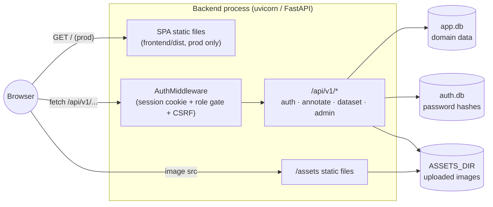
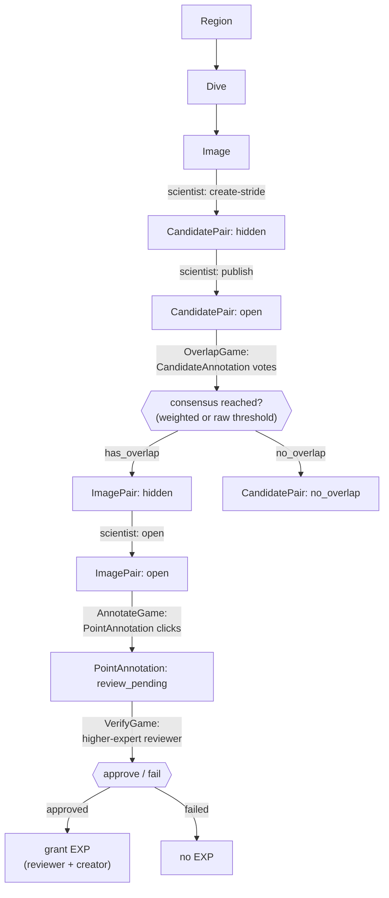

# Architecture

bigger_picture is a citizen-science web app: volunteers compare and annotate underwater survey images grouped into "dives", moving each image pair through a three-stage pipeline (overlap voting → point annotation → peer review) until scientists can export validated data.

## System overview

FastAPI serves both the JSON API and (in production) the built React SPA from a single process. Two SQLite databases keep domain data and password credentials separate.

- **Dev**: `docker-compose.yml` runs the backend (port 8000) and the Vite dev server (port 5173) as separate containers; the browser talks to the backend via CORS (`FRONTEND_ORIGIN`).
- **Prod**: root `Dockerfile` multi-stage build compiles `frontend/dist` and copies it into the backend image; `create_app()` mounts it as a catch-all SPA route (`backend/src/main.py:85-87`) so one process serves everything on one port.
- Auth is a plain httponly session cookie (`session_uuid`, holding the user's UUID) checked against `users` on every request, plus a stateless HMAC CSRF cookie required on unsafe methods — see `backend/src/api/middleware/auth_middleware.py`.

## Annotation pipeline

This is the core domain flow. Each arrow is a status transition, mostly gated by role (scientists create/publish, annotators vote/click, qualified reviewers approve).

- **Stage 1 — overlap voting** (`OverlapGame` → `POST /annotate/candidates/*`): annotators vote yes/no on whether two images overlap. Consensus is auto-computed after every vote by two independent thresholds (expert-weighted, and a raw-count cold-start path) — full details in [`candidate-auto-review.md`](candidate-auto-review.md). Reaching consensus auto-creates the downstream `ImagePair`.
- **Stage 2 — point annotation** (`AnnotateGame` → `POST /annotate/points/*`): once a scientist opens the `ImagePair`, annotators click matching points between the two images, each producing a `PointAnnotation`.
- **Stage 3 — peer review** (`VerifyGame` → `/annotate/points/review/*`): a scientist/admin, or any annotator whose `expert_level` exceeds the point's creator, approves or fails each pending point individually. There is no majority-consensus step here (unlike stage 1) — one qualifying reviewer's decision closes it out. Approval grants EXP to both reviewer and creator.
- Selection endpoints ("give me the next N items to work on") don't sample uniformly across everything eligible — `services/random_pool.py` draws from a bounded, deterministically-ordered pool (`id` ascending) so that voting effort concentrates on the oldest unresolved backlog instead of spreading thin across a large publish.

## Roles & API surface

Three roles, strictly ordered (`annotator < scientist < admin`), enforced per path-prefix by `AuthMiddleware`:

| Prefix | Min role | Purpose |
|---|---|---|
| `/api/v1/auth` | none | signup / login / logout / `me` / password / user "story" |
| `/api/v1/annotate` | annotator | gameplay: candidates, points, stats, leaderboard, quests, fun facts, region/dive pickers |
| `/api/v1/dataset` | scientist | dataset management: images, candidate pairs, image pairs, labels, cameras, dives, regions, export, bulk zip import |
| `/api/v1/admin` | admin | user management (incl. roles), DB backups |

Any other `/api/v1/*` path fails closed to admin-only.

## Directory layout

**`backend/src/`**
- `api/v1/` — the four route groups above, wired in `api/v1/router.py`
- `api/middleware/` — `AuthMiddleware` (session + role gate + CSRF)
- `models/` — Pydantic request/response schemas (API layer)
- `schema/` — SQLAlchemy ORM table definitions (DB layer)
- `services/` — business logic used by the routers (consensus, XP, quests, fun facts, dataset import/export, sampling, ...)
- `migrations/` — numbered plain-SQL migrations applied at startup (not Alembic-managed, despite the dependency)
- `password_auth/` — self-contained package for the separate `auth.db`

**`frontend/src/`**
- `components/` — screens: `LoginScreen`, `RegionSelectScreen` (3D globe picker), `HomeScreen`, the three game screens (`OverlapGame`, `AnnotateGame`, `VerifyGame`), stats/leaderboard/quests screens, shared UI (`AccountBar`, `FunFactModal`, ...)
- `components/admin/` — admin panels (`RegionsAdmin`, `DatasetAdmin`, `FunFactsAdmin`, `UsersAdmin`, `ZipUploadAdmin`, ...), gated by role rather than route prefix
- `api/` — one fetch-wrapper module per backend area, plus `client.ts` (fetch base + CSRF header injection)

## Gamification

- **EXP** is granted only for *reviewed-and-approved* work — `CANDIDATE_ANNOTATION_REVIEW_EXP` (stage 1) and `POINT_ANNOTATION_REVIEW_EXP` (stage 2/3) — never for raw, unreviewed submissions (`services/experience.py`). `User.expert_level` is derived from accumulated `exp` via a DB trigger.
- **Daily quests** (`services/quests.py`) aren't stored rows with state; they're a deterministic subset of a fixed catalog re-derived each day from a day-seeded RNG (same quests for everyone), with live progress computed on the fly from approved annotation counts. Only the claim of a completed quest's reward is persisted (`quest_claims`).
- **Fun facts** (`FunFact` → `FunFactModal`) surface periodically during gameplay, filtered by the player's region and `expert_level`, tracked per-user in `seen_facts` so the same fact isn't repeated too often.
